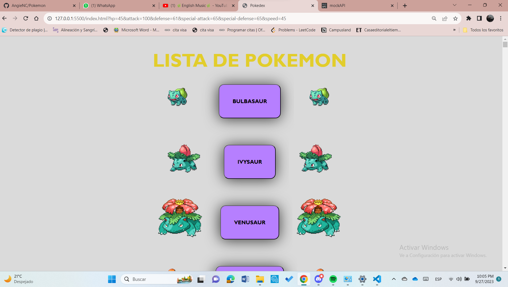
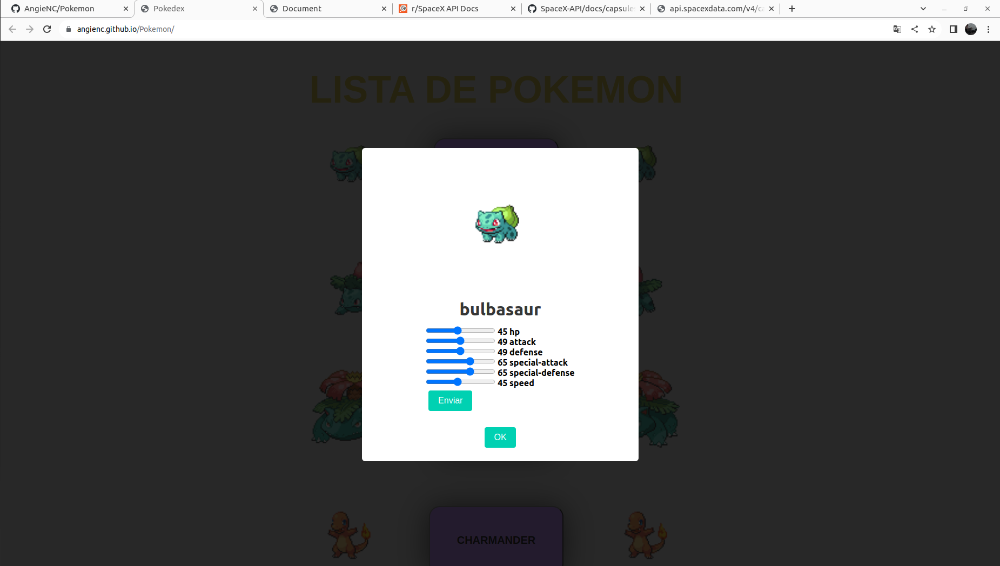
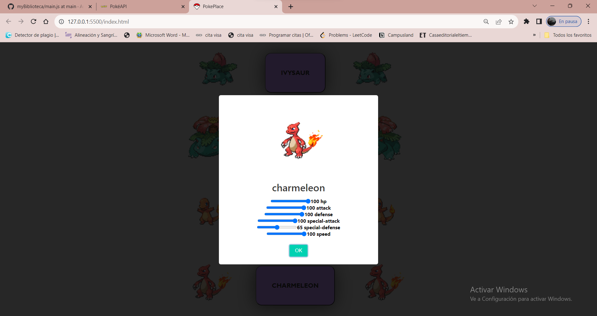

<h1>Proyecto Pokémon</h1>

Para este proyecto se pide crear botones que al presionarlos se pueda ver la información de cada uno de ellos gracias a un modal y puedes jugar con las estadísticas que luego verás en pantalla, todo ello relacionado a  los Pokemones, pues esta en la temática.

#### Objetivo de la página

Facilitarle al usuario los nombres de los 500 primeros pokemon y que pueda conocer las estadísticas de cada uno, además de que el mismo usuario pueda editarlas y guardarlas.

#### Tecnologías Utilizadas

- HTML
- JavaScript
- CSS
- PokéAPI (https://pokeapi.co/)
- Archivos JSON
- SweetAlert (Se utilizó para mostrar los modales)
- JSON server (http://127.0.0.1:5010/pokemon)

#### ¿Cómo funciona la página?

1. Para saber que contiene, solo debes oprimir en los botones que se te presentan.

2. Una vez que oprimas, te muestra la siguiente ventana con toda la información del pokemón:

   

3. Ahora podrás jugar con sus configuraciones, y se te verán los resultados en la API y cuando vuelvas a entrar a la tarjeta donde se te verán los datos.

#### Adicionales

- ##### Package.json:

  Para iniciar el servidor primero se debe instalar el package.json para tener le port y el host , por lo cual es el dev en los scripts.

- ##### Node: 

  Se utilizaron los módulos de node para desarrollar esta actividad.

- ##### Dependencias: 

  Se necesitan instalar las dependencias para que el servidor pueda ejecutarse y por lo cual la página funcione, de esta forma se instalan: `npm -E -D install json-server`y de esta forma se corre el servidor: `npm run dev`

#### Autora:

Angie Nathalia Cardenas Pinzon